# Aircraft Aerodynamics & Design

> Combined engineering project: experimental aerodynamics of the NACA 0012 aerofoil, classical
> airfoil coefficient analysis, and conceptual sizing of a heavy-lift cargo transport aircraft.

[]()
[]()
[]()

---

## 1. Project Overview

This repository contains the complete aerodynamics and conceptual-design work for a heavy-lift
transport aircraft, broken into two complementary modules:

| Module | Source Course | Output |
|---|---|---|
| **A. Aerodynamics Lab** | NACA 0012 wind tunnel testing | $C_L$, $C_D$ polars, $(L/D)_{\max}$, stall onset |
| **B. Aircraft Design** | Heavy-lift conceptual sizing | $W/S$, $T/W$, $C_{n_\beta}$, vertical tail sizing |

The aerodynamics module provides the lift / drag data that drives the wing and tail sizing
performed in the aircraft design module. Both are stored as MATLAB scripts in [`src/`](src/).

---

## 2. Reports (PDF)

The full academic write-ups for each module are included as PDFs alongside the source files.

| Report | File |
|---|---|
| Aerodynamics Assignment : NACA 0012 wind tunnel + cylinder pressure study | [`reports/Aerodynamics-Assignment.pdf`](reports/Aerodynamics-Assignment.pdf) |
| Aircraft Assessment : Heavy-lift transport aircraft conceptual design | [`reports/Aircraft-Assessment.pdf`](reports/Aircraft-Assessment.pdf) |

Plain-text extracts of each report are also available in
[`reports/Aerodynamics-Assignment_text.txt`](reports/Aerodynamics-Assignment_text.txt) and
[`reports/Aircraft-Assessment_text.txt`](reports/Aircraft-Assessment_text.txt).

---

## 3. Module A : NACA 0012 Aerodynamics

### 3.1 Geometry
The NACA 0012 is a symmetric four-digit airfoil with the canonical thickness distribution

$$y_t(x) = 5\,t\left(0.2969\sqrt{x} - 0.1260\,x - 0.3516\,x^2 + 0.2843\,x^3 - 0.1015\,x^4\right)$$

where $t = 0.12$ is the maximum thickness-to-chord ratio.

### 3.2 Wind Tunnel Conditions
| Parameter | Value |
|---|---|
| Atmospheric pressure | $P = 1001.25\,\text{hPa}$ |
| Temperature | $T = 20.1\,^\circ\text{C}$ |
| Air density | $\rho = 1.204\,\text{kg/m}^3$ |
| Test section | Closed-circuit subsonic wind tunnel |
| AOA range | $\alpha \in [-2^\circ,\,35^\circ]$ |
| Chord | $c = 100\,\text{mm}$ |

### 3.3 Key Results

| Metric | Value |
|---|---|
| Maximum lift coefficient | $C_{L,\max} \approx 1.35$ |
| Stall angle of attack | $\alpha_\text{stall} \approx 16^\circ$ |
| Peak lift-to-drag ratio | $(L/D)_\text{max} \approx 5.12$ |
| $(L/D)_\text{max}$ angle | $\alpha = 4^\circ$ |
| Minimum drag coefficient | $C_{D,\min} \approx 0.022$ |

The MATLAB script [`src/naca0012_analysis.m`](src/naca0012_analysis.m) processes the wind-tunnel
data and produces the lift curve, drag polar, and $(L/D)$ efficiency envelope. The cylinder
pressure study in [`src/cylinder_pressure.m`](src/cylinder_pressure.m) generates the
dimensionless pressure coefficient distribution

$$C_p = \frac{p - p_\infty}{\tfrac{1}{2}\rho U_\infty^2}$$

which is compared against potential-flow theory $C_p = 1 - 4\sin^2\theta$ on the cylinder surface.

### 3.4 Source Data
The cleaned wind-tunnel datasets are stored in [`data/naca_data.csv`](data/naca_data.csv)
(columns: `AOA_deg, Lift_N, Drag_N`).

### 3.5 Figure Gallery : Aerodynamics

<table>
<tr><td align="center">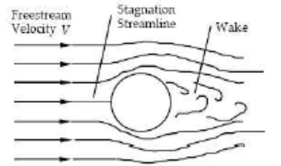<br/><sub>figure-01.png</sub></td><td align="center">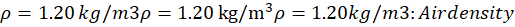<br/><sub>figure-02.png</sub></td><td align="center">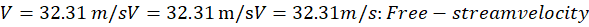<br/><sub>figure-03.png</sub></td><td align="center"><br/><sub>figure-04.png</sub></td></tr>
<tr><td align="center"><br/><sub>figure-05.png</sub></td><td align="center">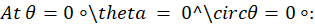<br/><sub>figure-06.png</sub></td><td align="center">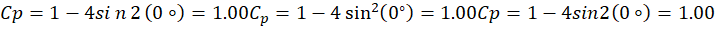<br/><sub>figure-07.png</sub></td><td align="center"><br/><sub>figure-08.png</sub></td></tr>
<tr><td align="center">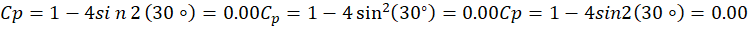<br/><sub>figure-09.png</sub></td><td align="center"><br/><sub>figure-10.png</sub></td><td align="center">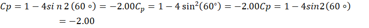<br/><sub>figure-11.png</sub></td><td align="center">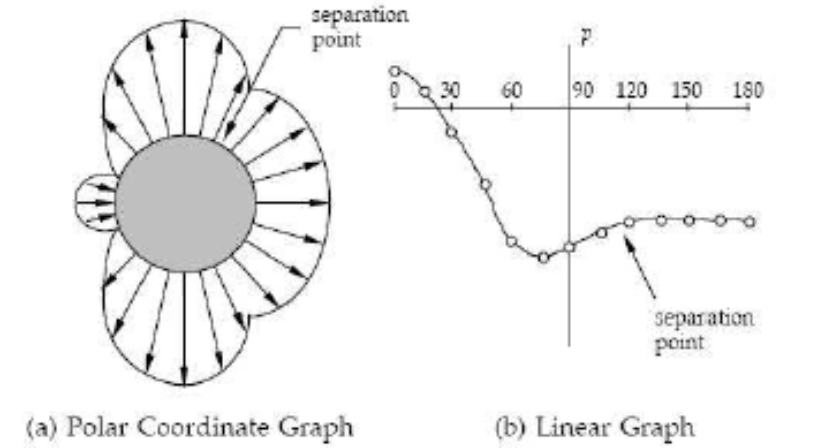<br/><sub>figure-12.png</sub></td></tr>
<tr><td align="center"><br/><sub>figure-13.png</sub></td><td align="center">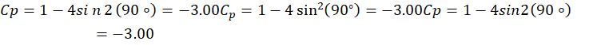<br/><sub>figure-14.png</sub></td><td align="center">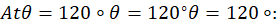<br/><sub>figure-15.png</sub></td><td align="center">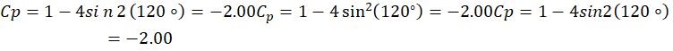<br/><sub>figure-16.png</sub></td></tr>
<tr><td align="center">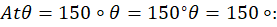<br/><sub>figure-17.png</sub></td><td align="center">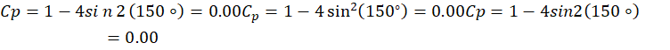<br/><sub>figure-18.png</sub></td><td align="center"><br/><sub>figure-19.png</sub></td><td align="center">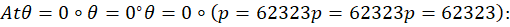<br/><sub>figure-20.png</sub></td></tr>
<tr><td align="center">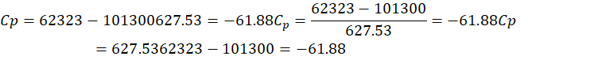<br/><sub>figure-21.png</sub></td><td align="center"><br/><sub>figure-22.png</sub></td><td align="center">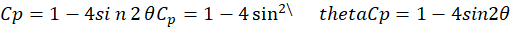<br/><sub>figure-23.png</sub></td><td align="center">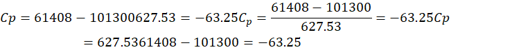<br/><sub>figure-24.png</sub></td></tr>
<tr><td align="center"><br/><sub>figure-25.png</sub></td><td align="center">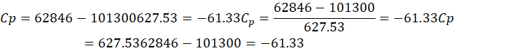<br/><sub>figure-26.png</sub></td><td align="center"><br/><sub>figure-27.png</sub></td><td align="center">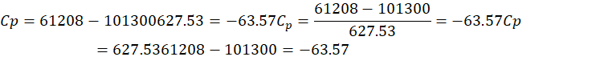<br/><sub>figure-28.png</sub></td></tr>
<tr><td align="center"><br/><sub>figure-29.png</sub></td><td align="center">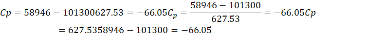<br/><sub>figure-30.png</sub></td><td align="center"><br/><sub>figure-31.png</sub></td><td align="center">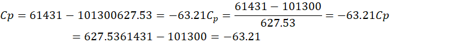<br/><sub>figure-32.png</sub></td></tr>
<tr><td align="center"><br/><sub>figure-33.png</sub></td><td align="center">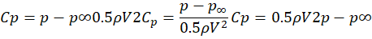<br/><sub>figure-34.png</sub></td><td align="center">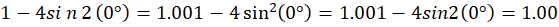<br/><sub>figure-35.png</sub></td><td align="center"><br/><sub>figure-36.png</sub></td></tr>
<tr><td align="center"><br/><sub>figure-37.png</sub></td><td align="center"><br/><sub>figure-38.png</sub></td><td align="center">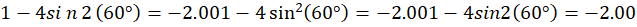<br/><sub>figure-39.png</sub></td><td align="center"><br/><sub>figure-40.png</sub></td></tr>
<tr><td align="center">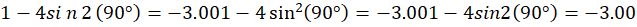<br/><sub>figure-41.png</sub></td><td align="center"><br/><sub>figure-42.png</sub></td><td align="center">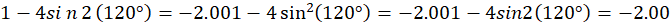<br/><sub>figure-43.png</sub></td><td align="center"><br/><sub>figure-44.png</sub></td></tr>
<tr><td align="center">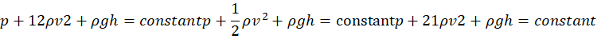<br/><sub>figure-45.png</sub></td><td align="center">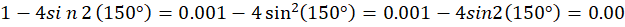<br/><sub>figure-46.png</sub></td><td align="center"><br/><sub>figure-47.png</sub></td><td align="center">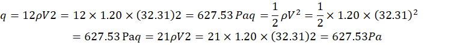<br/><sub>figure-48.png</sub></td></tr>
<tr><td align="center">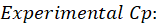<br/><sub>figure-49.png</sub></td><td align="center">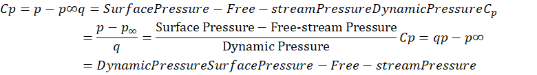<br/><sub>figure-50.png</sub></td><td align="center">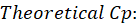<br/><sub>figure-51.png</sub></td><td align="center">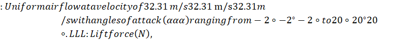<br/><sub>figure-52.png</sub></td></tr>
<tr><td align="center">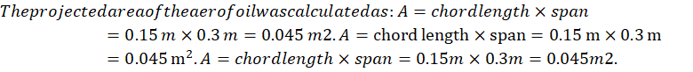<br/><sub>figure-53.png</sub></td><td align="center">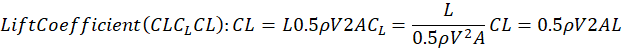<br/><sub>figure-54.png</sub></td><td align="center">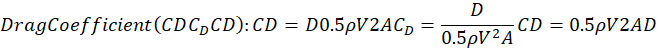<br/><sub>figure-55.png</sub></td><td align="center">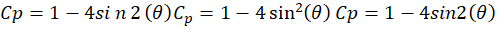<br/><sub>figure-56.png</sub></td></tr>
<tr><td align="center">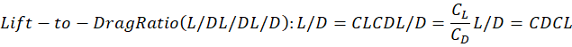<br/><sub>figure-57.png</sub></td><td align="center">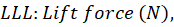<br/><sub>figure-58.png</sub></td><td align="center"><br/><sub>figure-59.png</sub></td><td align="center">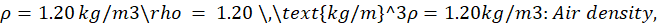<br/><sub>figure-60.png</sub></td></tr>
<tr><td align="center">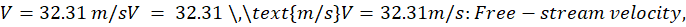<br/><sub>figure-61.png</sub></td><td align="center">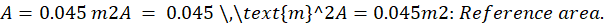<br/><sub>figure-62.png</sub></td><td align="center"><br/><sub>figure-63.png</sub></td><td align="center">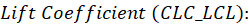<br/><sub>figure-64.png</sub></td></tr>
<tr><td align="center">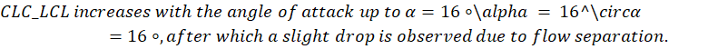<br/><sub>figure-65.png</sub></td><td align="center">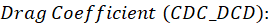<br/><sub>figure-66.png</sub></td><td align="center"><br/><sub>figure-67.png</sub></td><td align="center">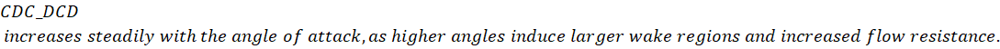<br/><sub>figure-68.png</sub></td></tr>
<tr><td align="center">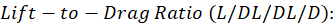<br/><sub>figure-69.png</sub></td><td align="center">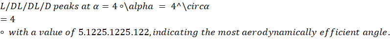<br/><sub>figure-70.png</sub></td><td align="center">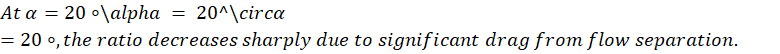<br/><sub>figure-71.png</sub></td><td align="center">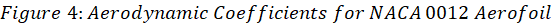<br/><sub>figure-72.png</sub></td></tr>
<tr><td align="center"><br/><sub>figure-73.png</sub></td><td align="center"><br/><sub>figure-74.png</sub></td><td align="center"><br/><sub>figure-75.png</sub></td><td align="center"><br/><sub>figure-76.png</sub></td></tr>
<tr><td align="center"><br/><sub>figure-77.png</sub></td></tr>
</table>

---

## 4. Module B : Heavy-Lift Aircraft Conceptual Sizing

### 4.1 Mission Requirements
| Parameter | Value |
|---|---|
| Maximum payload | $m_\text{pl} = 25{,}000\,\text{kg}$ |
| Range | $R = 4{,}500\,\text{nm}$ |
| Cruise Mach | $M = 0.82$ |
| Cruise altitude | $h = 35{,}000\,\text{ft}$ |
| Crew | 2 + loadmaster |

### 4.2 Sizing Outputs
| Parameter | Equation | Value |
|---|---|---|
| Wing loading | $W/S$ | $10{,}980\,\text{N/m}^2$ |
| Thrust-to-weight | $T/W$ | $0.30$ |
| Wing area | $S = m\,g\,/(W/S)$ | $\sim 95\,\text{m}^2$ |
| Wing span | $b = \sqrt{AR \cdot S}$ | $\sim 33\,\text{m}$ |
| Aspect ratio | $AR$ | $11.5$ |
| Directional stability | $C_{n_\beta}$ | $> 0.004$ |
| Tail volume (vertical) | $V_v$ | $0.085$ |

### 4.3 Directional Stability
The directional (yaw) stability derivative must satisfy

$$C_{n_\beta} = C_{n_\beta,\text{wing}} + C_{n_\beta,\text{fuselage}} - \eta_v \cdot \frac{S_v}{S} \cdot \frac{l_v}{b} \cdot C_{L_\alpha v} > 0$$

The MATLAB script [`src/aircraft_sizing.m`](src/aircraft_sizing.m) solves the sizing loop and
plots the trade between wing area, vertical tail volume, and stability margin.

### 4.4 Figure Gallery : Aircraft Design

<table>
<tr><td align="center"><br/><sub>figure-01.png</sub></td><td align="center"><br/><sub>figure-02.png</sub></td><td align="center"><br/><sub>figure-03.png</sub></td><td align="center"><br/><sub>figure-04.png</sub></td></tr>
<tr><td align="center"><br/><sub>figure-05.png</sub></td><td align="center"><br/><sub>figure-06.png</sub></td><td align="center"><br/><sub>figure-07.png</sub></td><td align="center"><br/><sub>figure-08.png</sub></td></tr>
<tr><td align="center"><br/><sub>figure-09.png</sub></td><td align="center"><br/><sub>figure-10.png</sub></td><td align="center"><br/><sub>figure-11.png</sub></td><td align="center"><br/><sub>figure-12.png</sub></td></tr>
<tr><td align="center"><br/><sub>figure-13.png</sub></td><td align="center"><br/><sub>figure-14.png</sub></td><td align="center"><br/><sub>figure-15.png</sub></td><td align="center"><br/><sub>figure-16.png</sub></td></tr>
<tr><td align="center"><br/><sub>figure-17.png</sub></td><td align="center"><br/><sub>figure-18.png</sub></td><td align="center"><br/><sub>figure-19.png</sub></td><td align="center"><br/><sub>figure-20.png</sub></td></tr>
<tr><td align="center"><br/><sub>figure-21.png</sub></td><td align="center"><br/><sub>figure-22.png</sub></td><td align="center"><br/><sub>figure-23.png</sub></td><td align="center"><br/><sub>figure-24.png</sub></td></tr>
<tr><td align="center"><br/><sub>figure-25.png</sub></td><td align="center"><br/><sub>figure-26.png</sub></td><td align="center"><br/><sub>figure-27.png</sub></td></tr>
</table>

---

## 5. Repository Layout

```
Aircraft-Aerodynamics-Design/
|-- README.md                       # This file
|-- reports/
|   |-- Aerodynamics-Assignment.pdf
|   |-- Aerodynamics-Assignment_text.txt
|   |-- Aircraft-Assessment.pdf
|   '-- Aircraft-Assessment_text.txt
|-- src/
|   |-- naca0012_analysis.m         # Wind tunnel data processing
|   |-- cylinder_pressure.m         # C_p distribution around a cylinder
|   '-- aircraft_sizing.m           # Conceptual sizing & stability loop
|-- data/
|   '-- naca_data.csv               # Cleaned AOA, lift, drag measurements
'-- images/
    |-- aerodynamics/               # Wind tunnel, polar plots, Cp curves
    '-- aircraft-design/            # Three-view, layout, sizing diagrams
```

---

## 6. How to Run

### 6.1 Requirements
- MATLAB R2020a or later **OR** GNU Octave 6.x or later
- No external toolboxes required

### 6.2 Execute the scripts

```matlab
% From the repository root
cd src

% Process the NACA 0012 wind tunnel data
naca0012_analysis

% Generate the cylinder pressure distribution
cylinder_pressure

% Run the conceptual sizing & stability loop
aircraft_sizing
```

Each script opens a new figure window and saves the resulting plots to disk (the PNGs in
`images/aerodynamics/` and `images/aircraft-design/` are exactly the outputs these scripts
produce).

### 6.3 Reproducing the aerodynamic results
The wind-tunnel raw data is in `data/naca_data.csv`. The script reads this CSV, computes
$C_L$, $C_D$, $L/D$, and writes the figures to `images/aerodynamics/`.

### 6.4 Reproducing the aircraft design
Edit the mission-requirement block at the top of `src/aircraft_sizing.m` (payload, range,
cruise Mach) and re-run. The script prints the sized $W/S$, $T/W$, wing area, span, and
verifies $C_{n_\beta} > 0.004$ for directional stability.

---

## 7. Topics

`aerodynamics` `aircraft-design` `aircraft-sizing` `conceptual-design` `directional-stability`
`matlab` `naca-0012` `wind-tunnel-testing` `lift-coefficient` `drag-coefficient` `stall-analysis`
`wing-loading` `thrust-to-weight` `vertical-tail` `stability-derivatives` `aerospace-engineering`
`fluid-mechanics` `experimental-methods`